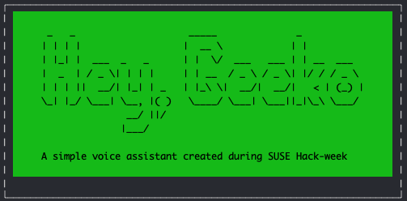
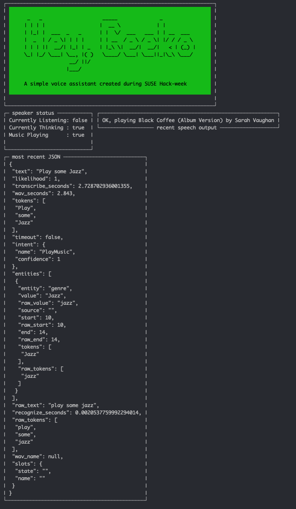

# Hey, Geeko



Geeko provides simple utilities such as telling the time, reading out weather reports and forecasts,
or even playing 30 seconds of your favorite songs by genre. Geeko is easily extendable, and new functionality 
can be written with minimal knowledge of NLP concepts. 


# Commands
Geeko will respond to the following commands once you speak the wake-word ('Hey, Geeko' or 'Hey, Mycroft' depending on how you have configured Geeko)

  + Time
    + What time is it?
    + What's the time?
  + Weather
    + How hot is it? 
    + What is the weather?
    + What is the hourly forecast?
    + What is the houlry forecast in [location]?
    + What is the weather in [location]
      + Check sentences.ini for a list of recognized locations, add more as you like
  + Music
    + Play some [genre]
      + Check sentences.ini for a list of recognized genres
      + You can add more genres, but they must be supported by the [deezer API](https://developers.deezer.com/api/explorer)
    + Play [filename]
      + Must add files manually for individual song playback, see the `Enhancing and customizing` section for more information
  + Help
    + I need help!
    + What can you do?
    + What can I say?

A list of intents, entities, and possible utterances can be found in `sentences.ini`. The Weather app requires an API 
a free API key from weatherapi.com which must be added to `pkg/cmd/.agent-config.yml`.


## Command Line Arguments 

```c
A simple voice assistant build using open-source software designed to run on raspberry pi's

Usage:
  geeko [command]

Available Commands:
  completion  Generate the autocompletion script for the specified shell
  help        Help about any command
  profile     Manage Voice Profiles and update intents
  start       Start the voice agent
  wake-word   commands to update the wake-word

Flags:
  -h, --help   help for geeko
```

To start Geeko with pretty-print console output run
`./geeko start -p`

<details closed>
<summary>Pretty Print Preview</summary>

</details>

To see debug information while using Geeko, run
`./geeko start -p -d`

# Required Hardware
+ A RaspberryPi 4 (or any Linux system)
+ A microphone (preferably plug and play a.k.a. no drivers required)
+ A speaker setup through either USB, Headphone jack, or HDMI

# Project Setup
A setup script (`setup.sh`) has been provided and minimally tested. Even if the script does not properly 
function for you (I'm not a bash expert), it serves as a reference for the required dependencies.  

Many of the project properties are specified within `pkg/cmd/.agent-config.yml`, ensure that the paths and options within that
file are correct for your system.

# Primary Tools and Technologies used within Geeko
+ [Voice2JSON](http://voice2json.org/)
  + A CLI tool that can perform ASR and process intents
+ [OpenTTS](https://github.com/synesthesiam/opentts)
  + A TTS server that offers a wide range of voices
+ [MyCroft Precise](https://github.com/MycroftAI/mycroft-precise)
  + A wake-word configuration and detection program, used to initiate voice commands 


## Custom 'Hey, Geeko' Wake-Word & Custom Wake-Word creation
The default wake-word included in voice2json is the phrase `"Hey, Mycroft"` since the Wake-word software used
is [Mycroft-precise](https://github.com/MycroftAI/mycroft-precise). This project includes a custom wake-word `Hey, geeko` (`hey-geeko.pb` & `hey-geeko.pb.params`). However, you are free to create your
own wake word if you want to. Please note that the `Hey, geeko` wake-word was trained using my voice only, so YMMV.
You can always enhance the model for your voice 🙂 or create a new one (it's pretty easy).  

A list of pre-included wake-words can be found in `pkg/cmd/.agent-config.yml`. All 
wake-word models can be found in, and must be stored in, `~/voice2json/etc/precise`.

To create a wake-word, follow the steps in the following link.
Make sure you are using python 3.7.x, otherwise the included setup script will not work.

https://github.com/MycroftAI/mycroft-precise/wiki/Training-your-own-wake-word

If you are doing model creation on an RPI, ensure you use a buster image (or any image that supports tensorflow 1.13.1). I was able to successfully train `Hey, Geeko` using a macbook with an intel processor.
For the best quality, ensure you supply the model with as much audio as possible. Refer [this section of mycroft precise to improve accuracy](https://github.com/MycroftAI/mycroft-precise/wiki/Training-your-own-wake-word#demoing-the-model)


# Customizing and Enhancing Geeko


### New Intents and Applications
Geeko can be easily enhanced to do whatever you want it to! In general, the process for enhancing Geeko goes as follows

+ Update `sentences.ini` to add new intents, entities, and slots 
  + refer to https://voice2json.org/sentences.html for help on working with `sentences.ini`
+ Move the new `sentences.ini` into the proper location
  + If you have this project and voice2json setup in your home directory (`~`) then you can run `./geeko profile update-sentences` to update `sentences.ini`
  + If you need to manually add this file, ensure it is placed in `.local/share/voice2json/<PROFILE_NAME>`
+ Train the model on your new sentences 
  + you can either run `./geeko profile train` or `voice2json --debug --profile [your_profile_name] train`
  + Training takes between 5-30 seconds!
+ Update Go Code
  + update `pkg/conversation/conversation_types.go` with your new intent
  + handle that intent within `pkg/agent/intentHandler.go` with whatever logic you want! 🥳

### Extra Music 
Geeko's music functionality when handling genres utilizes the public [Deezer API](https://github.com/MycroftAI/mycroft-precise) to play back 30 second previews of many songs. 
Geeko is also able to play local audio files, with the following constraints
+ All music files must be placed in `pkg/agent/cmds/music/files` and must have a name equal to the expected utterance with all spaces replaced with `_`.
  + For example, if you want to play Demon Days by the Gorillas, the file should be named `Demon_days.mp3`
+ Only MP3 files are supported, and they must be `pcm_s16le`
+ `sentences.ini` must be updated to handle the new file name


# Flaws and Limitations
 + TTS is a computationally intensive process, choosing a voice that your platform cannot handle will result in very long delays between your command and a response
 + Re-prompting could use additional work to differentiate between what you said before the re-prompt and after. Right now it just accepts what you say, even if geeko is speaking.
 + The `setup.sh` script may not work on all systems.
 + Playing local audio files is pretty fragile

